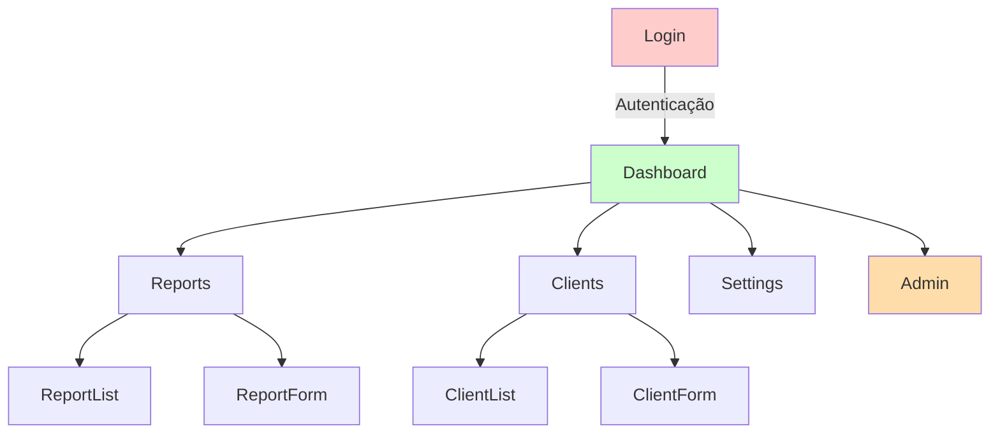
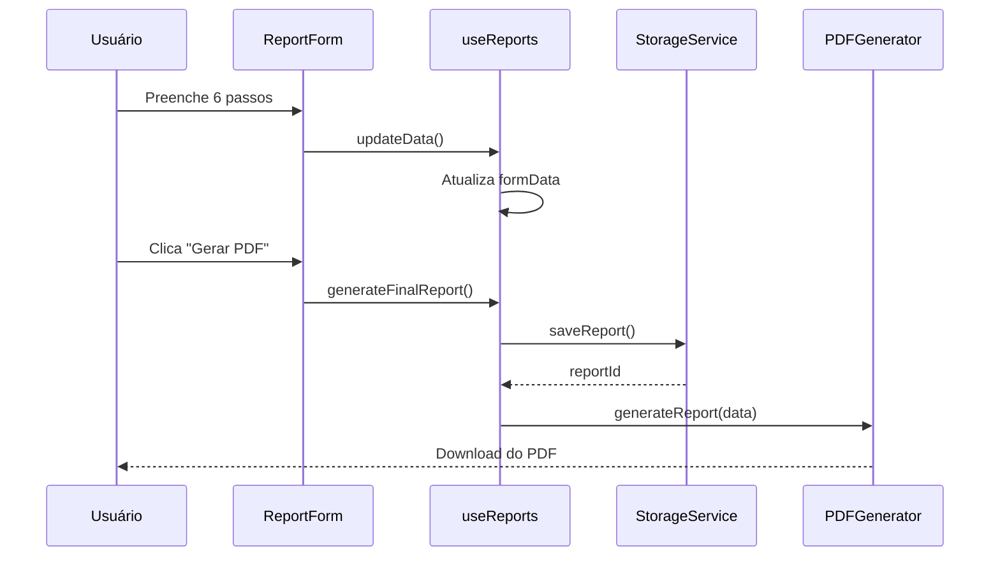
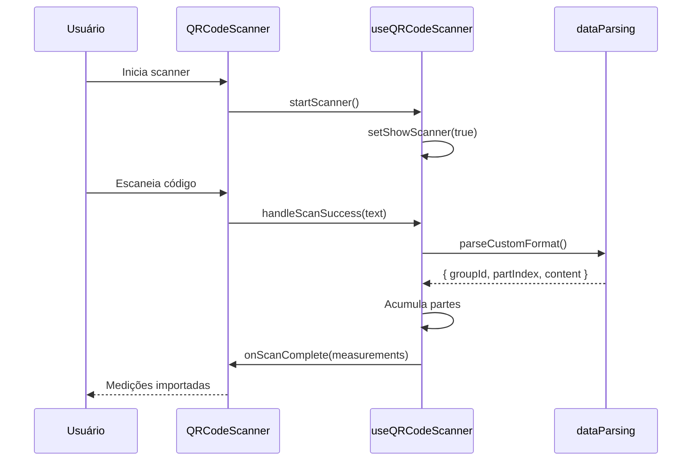
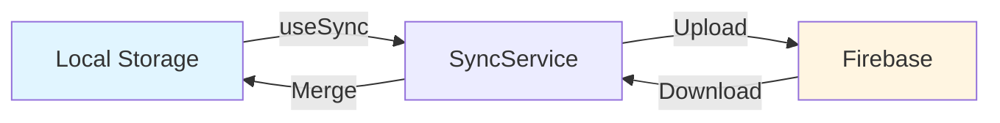
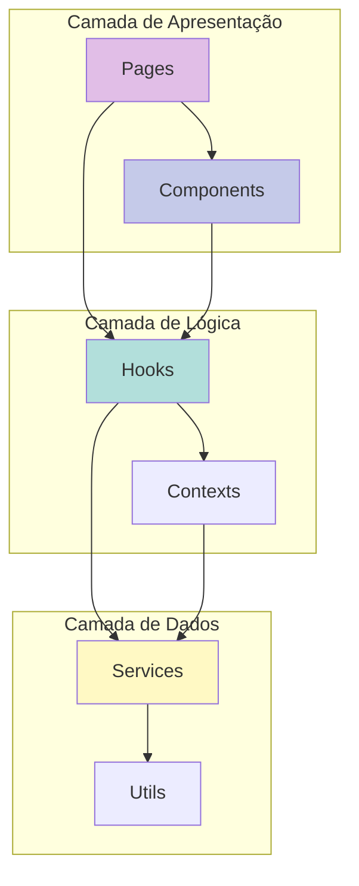

# Revisão da Arquitetura do Projeto SPDA-Web

## Resumo Executivo

O projeto **SPDA-Web** é uma aplicação React moderna para geração de laudos de Sistema de Proteção contra Descargas Atmosféricas (SPDA). A aplicação foi refatorada com foco em **modularização**, **abstração de lógica** e **organização de componentes**, resultando em uma arquitetura limpa e manutenível.

### Principais Melhorias Identificadas

✅ **Separação de Responsabilidades**: Hooks customizados isolam lógica de negócio  
✅ **Componentes Modulares**: Estrutura padronizada com `index.jsx` + `styles.css`  
✅ **Services Centralizados**: Camada de serviços bem definida  
✅ **Utilitários Reutilizáveis**: Funções auxiliares compartilhadas

---

## Stack Tecnológico

| Categoria | Tecnologia | Versão |
|-----------|-----------|--------|
| **Framework** | React | 19.2.0 |
| **Build Tool** | Vite | 7.2.4 |
| **Roteamento** | React Router DOM | 7.9.6 |
| **Backend** | Firebase | 12.6.0 |
| **PDF** | jsPDF + jsPDF AutoTable | 3.0.4 + 5.0.2 |
| **QR Code** | html5-qrcode | 2.3.8 |
| **Compressão** | browser-image-compression | 2.0.2 |
| **Ícones** | Lucide React | 0.554.0 |

---

## Estrutura de Diretórios

```
src/
├── assets/                  # Recursos estáticos
├── components/              # 30 componentes organizados
│   ├── Admin/              # 3 componentes
│   ├── Auth/               # 1 componente
│   ├── Dashboard/          # 2 componentes
│   ├── Layout/             # 3 componentes
│   ├── Report/             # 11 componentes
│   ├── Settings/           # 8 componentes
│   └── Shared/             # 3 componentes
├── contexts/               # Contexts do React
├── hooks/                  # 10 hooks customizados
├── pages/                  # 8 páginas principais
├── services/               # 7 serviços
├── utils/                  # 4 utilitários
├── App.jsx                 # Router principal
├── index.css              # Estilos globais
└── main.jsx               # Entry point
```

---

## 1. Componentes (`src/components/`)

### 1.1 Padrão de Organização

Todos os componentes seguem a estrutura modular:

```
ComponentName/
├── index.jsx      # Lógica do componente
└── styles.css     # Estilos isolados
```

### 1.2 Módulos de Componentes

#### 📁 **Admin** (3 componentes)
- [UserManagement](file:///c:/Users/STE/Documents/spda-web/src/components/Admin/UserManagement/index.jsx) - Gerenciamento de usuários (admin)
- [UserOnDesktop](file:///c:/Users/STE/Documents/spda-web/src/components/Admin/UserOnDesktop/index.jsx) - Vista desktop para admin
- [UserOnMobile](file:///c:/Users/STE/Documents/spda-web/src/components/Admin/UserOnMobile/index.jsx) - Vista mobile para admin

#### 🔐 **Auth** (1 componente)
- [ProtectedRoute](file:///c:/Users/STE/Documents/spda-web/src/components/Auth/ProtectedRoute/index.jsx) - Rota protegida com autenticação

#### 📊 **Dashboard** (2 componentes)
- [StatCard](file:///c:/Users/STE/Documents/spda-web/src/components/Dashboard/StatCard/index.jsx) - Card de estatísticas
- [RecentReports](file:///c:/Users/STE/Documents/spda-web/src/components/Dashboard/RecentReports/index.jsx) - Relatórios recentes

#### 🎨 **Layout** (3 componentes)
- [Layout](file:///c:/Users/STE/Documents/spda-web/src/components/Layout/Layout/index.jsx) - Layout principal
- [Header](file:///c:/Users/STE/Documents/spda-web/src/components/Layout/Header/index.jsx) - Cabeçalho da aplicação
- [Sidebar](file:///c:/Users/STE/Documents/spda-web/src/components/Layout/Sidebar/index.jsx) - Menu lateral

#### 📄 **Report** (11 componentes)
##### Template:
- [ReportTemplate](file:///c:/Users/STE/Documents/spda-web/src/components/Report/ReportTemplate/index.jsx) - Template do PDF

##### Steps (9 componentes):
- [InitialInfo](file:///c:/Users/STE/Documents/spda-web/src/components/Report/Steps/InitialInfo/index.jsx) - Passo 1: Informações iniciais
- [BuildingData](file:///c:/Users/STE/Documents/spda-web/src/components/Report/Steps/BuildingData/index.jsx) - Passo 2: Dados da edificação
- [Checklist](file:///c:/Users/STE/Documents/spda-web/src/components/Report/Steps/Checklist/index.jsx) - Passo 3: Checklist de verificação
- [MeasurementData](file:///c:/Users/STE/Documents/spda-web/src/components/Report/Steps/MeasurementData/index.jsx) - Passo 4: Dados de medições
- [TechnicalOpinion](file:///c:/Users/STE/Documents/spda-web/src/components/Report/Steps/TechnicalOpinion/index.jsx) - Passo 5: Parecer técnico
- [Attachments](file:///c:/Users/STE/Documents/spda-web/src/components/Report/Steps/Attachments/index.jsx) - Passo 6: Anexos
- [QRCodeScanner](file:///c:/Users/STE/Documents/spda-web/src/components/Report/Steps/QRCodeScanner/index.jsx) - Scanner de QR Code para medições
- [EquipmentData](file:///c:/Users/STE/Documents/spda-web/src/components/Report/Steps/EquipmentData/index.jsx) - Dados de equipamentos
- [Signature](file:///c:/Users/STE/Documents/spda-web/src/components/Report/Steps/Signature/index.jsx) - Assinatura do responsável

#### ⚙️ **Settings** (8 componentes)
- [Settings](file:///c:/Users/STE/Documents/spda-web/src/components/Settings/Settings/index.jsx) - Container principal
- [SubscriptionPlan](file:///c:/Users/STE/Documents/spda-web/src/components/Settings/SubscriptionPlan/index.jsx) - Plano de assinatura
- [StorageSettings](file:///c:/Users/STE/Documents/spda-web/src/components/Settings/StorageSettings/index.jsx) - Modo de armazenamento (local/nuvem)
- [DataSync](file:///c:/Users/STE/Documents/spda-web/src/components/Settings/DataSync/index.jsx) - Sincronização de dados
- [ChecklistConfiguration](file:///c:/Users/STE/Documents/spda-web/src/components/Settings/ChecklistConfiguration/index.jsx) - Configuração de checklist
- [EngineerSettings](file:///c:/Users/STE/Documents/spda-web/src/components/Settings/EngineerSettings/index.jsx) - Dados do engenheiro + assinatura
- [EquipmentSettings](file:///c:/Users/STE/Documents/spda-web/src/components/Settings/EquipmentSettings/index.jsx) - Dados dos equipamentos
- [ReportCustomization](file:///c:/Users/STE/Documents/spda-web/src/components/Settings/ReportCustomization/index.jsx) - Logo e cores do relatório

#### 🔧 **Shared** (3 componentes reutilizáveis)
- [Button](file:///c:/Users/STE/Documents/spda-web/src/components/Shared/Button/index.jsx) - Botão customizado
- [Input](file:///c:/Users/STE/Documents/spda-web/src/components/Shared/Input/index.jsx) - Campo de entrada
- [ColorPicker](file:///c:/Users/STE/Documents/spda-web/src/components/Shared/ColorPicker/index.jsx) - Seletor de cores

---

## 2. Hooks Customizados (`src/hooks/`)

### Abstração de Lógica de Negócio

Os hooks foram criados para **extrair e centralizar lógica complexa**, melhorando a reusabilidade e testabilidade:

| Hook | Responsabilidade | Usado em |
|------|-----------------|----------|
| [useAuthForm](file:///c:/Users/STE/Documents/spda-web/src/hooks/useAuthForm.js) | Gerencia formulário de login/cadastro | Login |
| [useAuthObserver](file:///c:/Users/STE/Documents/spda-web/src/hooks/useAuthObserver.js) | Observa estado de autenticação | AuthContext |
| [useChecklistSettings](file:///c:/Users/STE/Documents/spda-web/src/hooks/useChecklistSettings.js) | CRUD de itens do checklist | Settings |
| [useClients](file:///c:/Users/STE/Documents/spda-web/src/hooks/useClients.js) | Gerenciamento de clientes | ClientList, ClientForm |
| [useResponsive](file:///c:/Users/STE/Documents/spda-web/src/hooks/useResponsive.js) | Detecta layout/dispositivo móvel | Layout, Componentes |
| [useQRCodeScanner](file:///c:/Users/STE/Documents/spda-web/src/hooks/useQRCodeScanner.js) | Lógica de escaneamento QR | QRCodeScanner |
| [useReports](file:///c:/Users/STE/Documents/spda-web/src/hooks/useReports.js) | Gerencia relatórios (CRUD + steps) | ReportForm, ReportList |
| [useStorageMode](file:///c:/Users/STE/Documents/spda-web/src/hooks/useStorageMode.js) | Controla modo local/nuvem | Settings |
| [useSync](file:///c:/Users/STE/Documents/spda-web/src/hooks/useSync.js) | Sincronização local ↔ nuvem | Settings |
| [useUserManagement](file:///c:/Users/STE/Documents/spda-web/src/hooks/useUserManagement.js) | Administração de usuários | Admin |

### Destaque: `useReports`

O hook mais complexo, consolidando:
- Estado do formulário multi-step
- Navegação entre passos
- Operações CRUD (criar, editar, listar, deletar)
- Geração de PDF
- Integração com serviços (Storage, Settings)

**Antes da refatoração**: Lógica espalhada em vários componentes  
**Depois**: Centralizada em um único hook de **~180 linhas**

---

## 3. Services (`src/services/`)

### Camada de Abstração de Dados

| Service | Responsabilidade |
|---------|-----------------|
| [AuthService](file:///c:/Users/STE/Documents/spda-web/src/services/AuthService.js) | Autenticação Firebase |
| [ClientService](file:///c:/Users/STE/Documents/spda-web/src/services/ClientService.js) | CRUD de clientes |
| [LocalStorageService](file:///c:/Users/STE/Documents/spda-web/src/services/LocalStorageService.js) | Armazenamento local (IndexedDB) |
| [SettingsService](file:///c:/Users/STE/Documents/spda-web/src/services/SettingsService.js) | Configurações do usuário |
| [StorageService](file:///c:/Users/STE/Documents/spda-web/src/services/StorageService.js) | Abstração local/nuvem para relatórios |
| [SyncService](file:///c:/Users/STE/Documents/spda-web/src/services/SyncService.js) | Sincronização de dados |
| [firebase](file:///c:/Users/STE/Documents/spda-web/src/services/firebase.js) | Configuração Firebase |

### Padrão de Design: Strategy Pattern

O `StorageService` implementa um **padrão strategy** para alternar entre armazenamento local e nuvem:

```javascript
const mode = getStorageMode(); // 'local' ou 'cloud'
if (mode === 'local') {
    return await LocalStorageService.saveReport(...);
}
// Caso contrário, usa Firebase
```

**Benefício**: Troca de implementação sem alterar código dos componentes.

---

## 4. Utilitários (`src/utils/`)

### Funções Auxiliares Compartilhadas

| Utilitário | Função |
|-----------|--------|
| [PDFGenerator](file:///c:/Users/STE/Documents/spda-web/src/utils/PDFGenerator.jsx) | Renderiza componente React → Canvas → PDF |
| [asyncUtils](file:///c:/Users/STE/Documents/spda-web/src/utils/asyncUtils.js) | Helpers assíncronos |
| [dataParsing](file:///c:/Users/STE/Documents/spda-web/src/utils/dataParsing.js) | Parse de QR codes customizados |
| [formatters](file:///c:/Users/STE/Documents/spda-web/src/utils/formatters.js) | Formatação de unidades (Ω, kΩ, mΩ, etc.) |

### Destaque: `dataParsing.js`

Funções especializadas para interpretar QR codes de medições:
- `parseCustomFormat()` - Lê formato multi-parte (G1[1/3]:...)
- `parseMeasurementPoint()` - Extrai valores de resistência/corrente

---

## 5. Páginas (`src/pages/`)

### Rotas Principais



| Página | Rota | Componentes Principais |
|--------|------|----------------------|
| [Login](file:///c:/Users/STE/Documents/spda-web/src/pages/Auth/Login.jsx) | `/login` | `useAuthForm` |
| [Dashboard](file:///c:/Users/STE/Documents/spda-web/src/pages/Dashboard/index.jsx) | `/` | `StatCard`, `RecentReports` |
| [ReportForm](file:///c:/Users/STE/Documents/spda-web/src/pages/Reports/ReportForm/index.jsx) | `/new-report` | 9 steps + `useReports` |
| [ReportList](file:///c:/Users/STE/Documents/spda-web/src/pages/Reports/ReportList/index.jsx) | `/reports` | `useReports` |
| [ClientList](file:///c:/Users/STE/Documents/spda-web/src/pages/Clients/ClientList/index.jsx) | `/clients` | `useClients` |
| [ClientForm](file:///c:/Users/STE/Documents/spda-web/src/pages/Clients/ClientForm/index.jsx) | `/client-form` | `useClients` |
| [Settings](file:///c:/Users/STE/Documents/spda-web/src/pages/Settings/index.jsx) | `/settings` | 8 componentes de configuração |
| [Admin](file:///c:/Users/STE/Documents/spda-web/src/pages/Admin/index.jsx) | `/admin` | `useUserManagement` |

---

## 6. Fluxos Principais

### 6.1 Geração de Relatório



### 6.2 Scanner de QR Code



### 6.3 Sincronização de Dados



---

## 7. Mudanças Recentes Identificadas

### ✅ Componentes Refatorados

1. **Settings componentizado** em 8 módulos
   - Antes: Um arquivo monolítico
   - Depois: 8 componentes especializados

2. **Layout modularizado**
   - Extraídos: `Header`, `Sidebar`, `Layout`
   - Cada um com seu `styles.css`

3. **Shared Components criados**
   - `Button`, `Input`, `ColorPicker`
   - Reutilizáveis em toda aplicação

### 🗑️ Componentes Removidos/Consolidados

> **Nota**: Não foram identificados arquivos duplicados ou inutilizados na estrutura atual. A arquitetura está limpa.

### 🆕 Hooks Criados

Todos os 10 hooks são recentes e ativos:
- `useAuthForm` - Abstração de lógica de autenticação
- `useReports` - Gerenciamento de relatórios
- `useQRCodeScanner` - Scanner de QR
- `useChecklistSettings` - Configuração de checklist
- E outros...

### 📦 Padrões Estabelecidos

1. **Componentes**: `ComponentName/index.jsx` + `ComponentName/styles.css`
2. **Hooks**: Prefixo `use` + lógica isolada
3. **Services**: Objeto exportado com métodos async
4. **Utils**: Funções puras exportadas

---

## 8. Qualidade do Código

### Pontos Fortes

✅ **Separação de Responsabilidades**: Cada módulo tem função clara  
✅ **DRY (Don't Repeat Yourself)**: Hooks eliminam duplicação  
✅ **Componentização**: 30 componentes bem organizados  
✅ **Modularidade**: CSS isolado por componente  
✅ **Type Safety**: Props bem definidas (sem TypeScript, mas documentadas)

### Oportunidades de Melhoria

⚠️ **TypeScript**: Projeto em JS puro (sem tipagem estática)  
⚠️ **Testes**: Ausência de arquivos de teste  
⚠️ **PropTypes**: Sem validação de props em runtime  
⚠️ **Documentação**: README padrão do Vite (não customizado)  
⚠️ **Error Boundaries**: Sem tratamento global de erros

---

## 9. Arquitetura Visual

### Hierarquia de Dependências



### Fluxo de Dados

```
User Input → Page → Hook → Service → Firebase/LocalStorage
                ↓
           Component ← State Update
```

---

## 10. Métricas do Projeto

| Categoria | Quantidade |
|-----------|-----------|
| **Componentes** | 30 |
| **Hooks** | 10 |
| **Services** | 7 |
| **Utils** | 4 |
| **Páginas** | 8 |
| **Arquivos CSS** | 30 (1 por componente) |
| **Dependências** | 11 principais |
| **Dev Dependencies** | 8 |
| **Total de Linhas** | ~15.000+ (estimado) |

---

## 11. Próximos Passos Recomendados

### Prioridade Alta
1. ✅ **Adicionar TypeScript** para type safety
2. ✅ **Implementar testes** (Jest + React Testing Library)
3. ✅ **Adicionar PropTypes** para validação de props
4. ✅ **Error Boundaries** para tratamento global de erros

### Prioridade Média
5. ✅ **Melhorar README** com documentação do projeto
6. ✅ **Code Splitting** para otimizar bundle size
7. ✅ **Storybook** para documentação de componentes
8. ✅ **CI/CD** com GitHub Actions

### Prioridade Baixa
9. ✅ **Internacionalização** (i18n para múltiplos idiomas)
10. ✅ **PWA** para funcionar offline

---

## Conclusão

O projeto **SPDA-Web** apresenta uma **arquitetura sólida e bem organizada**, resultado de refatorações recentes que priorizaram:

- **Modularização** de componentes
- **Abstração** de lógica em hooks
- **Separação** de responsabilidades
- **Padrões** consistentes de código

A estrutura atual está **pronta para escalar** e facilita:
- Manutenção contínua
- Adição de novas funcionalidades
- Onboarding de novos desenvolvedores
- Refatorações futuras

### Estado Geral: ✅ **Saudável e Bem Arquitetado**

---

*Documento gerado em: 2025-12-03*  
*Projeto: SPDA-Web*  
*Versão: 0.0.0*
